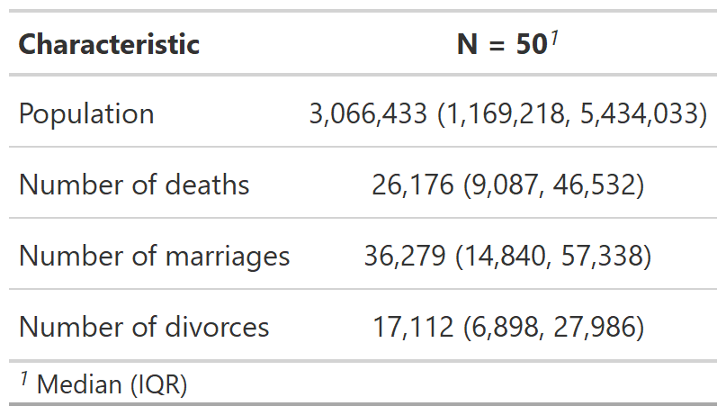
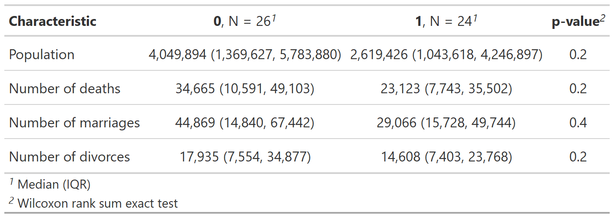

<!-- README.md is generated from README.Rmd. Please edit that file -->

# Building Summary Statistics Tables with `modelsummary` and `gtsummary`

<!-- badges: start -->
<!-- badges: end -->

`modelsummary` and `gtsummary` are two excellent r packages to build
summary statistics. However, their syntax might not be fully intituitive
if you are comming from Stata. Here are a couple of examples using these
two packages.

First, let’s load the following packages and load our data:

``` r
library(tidyverse)
library(gtsummary)
library(modelsummary)
library(haven)

census <- read_dta("http://www.stata-press.com/data/r9/census.dta") %>%
  # Create dummy treatment
  mutate(
    rand = runif(n()),
    treatment = as.numeric(rand > 0.5)
  )
```

I’m using the census stata dta file for those who are familiar with this
Stata dataset.

## Model Summary

When it comes to model summary, we have two approaches: (1) a rapid data
summary, and (2) a more elaborated one. For the former, we use the
`datasummary_skim()` function as follows:

``` r
datasummary_skim(census)
```

|           | Unique (#) | Missing (%) |      Mean |        SD |      Min |    Median |        Max |
|:----------|-----------:|------------:|----------:|----------:|---------:|----------:|-----------:|
| region    |          4 |           0 |       2.7 |       1.1 |      1.0 |       3.0 |        4.0 |
| pop       |         50 |           0 | 4518149.4 | 4715037.8 | 401851.0 | 3066433.0 | 23667902.0 |
| poplt5    |         50 |           0 |  326277.8 |  331585.1 |  35998.0 |  227467.5 |  1708400.0 |
| pop5_17   |         50 |           0 |  945951.6 |  959372.8 |  91796.0 |  629654.0 |  4680558.0 |
| pop18p    |         50 |           0 | 3245920.1 | 3430531.3 | 271106.0 | 2175130.0 | 17278944.0 |
| pop65p    |         50 |           0 |  509502.8 |  538932.4 |  11547.0 |  370495.0 |  2414250.0 |
| popurban  |         50 |           0 | 3328253.2 | 4090177.9 | 172735.0 | 2156905.0 | 21607606.0 |
| medage    |         37 |           0 |      29.5 |       1.7 |     24.2 |      29.8 |       34.7 |
| death     |         50 |           0 |   39474.3 |   41742.3 |   1604.0 |   26176.5 |   186428.0 |
| marriage  |         50 |           0 |   47701.4 |   45130.4 |   4437.0 |   36279.0 |   210864.0 |
| divorce   |         50 |           0 |   23679.4 |   25094.0 |   2142.0 |   17112.5 |   133541.0 |
| rand      |         50 |           0 |       0.5 |       0.3 |      0.0 |       0.5 |        1.0 |
| treatment |          2 |           0 |       0.5 |       0.5 |      0.0 |       0.0 |        1.0 |

If we want to select only a few variables, we could past a variables
vector to the `select` function or create a new object with only the
variables we need.

``` r
census %>%
  select(pop, death, marriage, divorce) %>%
  datasummary_skim()
```

|          | Unique (#) | Missing (%) |      Mean |        SD |      Min |    Median |        Max |
|:---------|-----------:|------------:|----------:|----------:|---------:|----------:|-----------:|
| pop      |         50 |           0 | 4518149.4 | 4715037.8 | 401851.0 | 3066433.0 | 23667902.0 |
| death    |         50 |           0 |   39474.3 |   41742.3 |   1604.0 |   26176.5 |   186428.0 |
| marriage |         50 |           0 |   47701.4 |   45130.4 |   4437.0 |   36279.0 |   210864.0 |
| divorce  |         50 |           0 |   23679.4 |   25094.0 |   2142.0 |   17112.5 |   133541.0 |

In addition, we can let the function knows if we would like to have only
summary statistics for those variables that are either numeric or
categorical, for example:

``` r
datasummary_skim(census, type = "numeric")
```

If we would like to have only the mean, sd, min, max instead of all the
statistics that are presented using `datasummary_skim` we can use a
2-sided formula.

``` r
build <- pop + death + marriage + divorce ~ N + Mean + SD + Median + Min + Max 

## Without labels

datasummary(
  build,
  data = census
) 
```

|          |   N |       Mean |         SD |     Median |       Min |         Max |
|:---------|----:|-----------:|-----------:|-----------:|----------:|------------:|
| pop      |  50 | 4518149.44 | 4715037.75 | 3066433.00 | 401851.00 | 23667902.00 |
| death    |  50 |   39474.26 |   41742.35 |   26176.50 |   1604.00 |   186428.00 |
| marriage |  50 |   47701.40 |   45130.42 |   36279.00 |   4437.00 |   210864.00 |
| divorce  |  50 |   23679.44 |   25094.01 |   17112.50 |   2142.00 |   133541.00 |

In the case of variables labels, we will need to modify those variables
names.

``` r
## With labels

build <- `Population` + `Number of deaths` + `Number of marriages` + `Number of divorces` ~ N + Mean + SD + Median + Min + Max 

datasummary(
  build,
  data = census %>% 
    rename(`Population` = pop, `Number of deaths` = death, `Number of marriages` = marriage, `Number of divorces` = divorce)
) 
```

|                     |   N |       Mean |         SD |     Median |       Min |         Max |
|:--------------------|----:|-----------:|-----------:|-----------:|----------:|------------:|
| Population          |  50 | 4518149.44 | 4715037.75 | 3066433.00 | 401851.00 | 23667902.00 |
| Number of deaths    |  50 |   39474.26 |   41742.35 |   26176.50 |   1604.00 |   186428.00 |
| Number of marriages |  50 |   47701.40 |   45130.42 |   36279.00 |   4437.00 |   210864.00 |
| Number of divorces  |  50 |   23679.44 |   25094.01 |   17112.50 |   2142.00 |   133541.00 |

Finally, we can use the `output` argument to export our table to a
several file formats.

``` r
build <- pop + death + marriage + divorce ~ N + Mean + SD + Median + Min + Max 

datasummary(
  build,
  data = census,
  output = "latex"
) 
```

In the case of latex, your output would like this and you can use the
`\input` command in your latex document to add your table to your
reports or working papers:

    \begin{table}
    \centering
    \begin{tabular}[t]{lrrrrrr}
    \toprule
      & N & Mean & SD & Median & Min & Max\\
    \midrule
    pop & 50 & \num{4518149.44} & \num{4715037.75} & \num{3066433.00} & \num{401851.00} & \num{23667902.00}\\
    death & 50 & \num{39474.26} & \num{41742.35} & \num{26176.50} & \num{1604.00} & \num{186428.00}\\
    marriage & 50 & \num{47701.40} & \num{45130.42} & \num{36279.00} & \num{4437.00} & \num{210864.00}\\
    divorce & 50 & \num{23679.44} & \num{25094.01} & \num{17112.50} & \num{2142.00} & \num{133541.00}\\
    \bottomrule
    \end{tabular}
    \end{table}

Check the official official
[vignette](https://vincentarelbundock.github.io/modelsummary/articles/datasummary.html)
for more examples.

## GT Summary

`gtsummary` is another package that can be used for basic and complex
summary statistics. Its syntax follows the `gt` family. For a basic
summary statistics table, we can use the `tbl_summary()` function as
follows:

``` r
vars <- c("pop", "death", "marriage", "divorce")

tab1 <- census %>% 
  select(all_of(vars)) %>% 
  tbl_summary()
```



By treatment variable:

``` r
tab2 <- census %>%
  select(all_of(vars), treatment) %>%
  tbl_summary(by = treatment) %>%
  add_p()
```


Given that we would like to have a more econ-paper type of descriptive
statistics, we can pass the columns we would like to have in a
vectorized way.

``` r
cols <- c(N = "{N_nonmiss}", Mean = "{mean} ({sd})", Median = "{median}", Min = "{min}", Max = "{max}")
tab3 <- cols %>% 
  # we would go through each of these columns
  imap(
    ~ census %>% 
      # and select the variables we need in our table
      select(all_of(vars)) %>% 
      tbl_summary(
        statistic = all_continuous() ~ .x
      ) %>% 
      # We will modify the title of cols headers
      modify_header(stat_0 ~ str_glue("{.y}"), label ~ "Variables") 
  ) %>% 
  # and merge every single of the columns into one single table
  tbl_merge() %>% 
  # remove spanning headers and footnote
  modify_spanning_header(everything() ~ NA) %>%
  modify_footnote(everything() ~ NA) 
```



And, finally, we can use the `as_kable_extra` function to export our
table to latex. The full example is here below:

``` r
tab3 %>%
  as_kable_extra(
    format = "latex", 
    booktabs = TRUE, 
    linesep = ""
  )
```

That gives you the following latex code:

    \begin{tabular}{lccccc}
    \toprule
    Variables & N & Mean & Median & Min & Max\\
    \midrule
    Population & 50 & 4,518,149 (4,715,038) & 3,066,433 & 401,851 & 23,667,902\\
    Number of deaths & 50 & 39,474 (41,742) & 26,176 & 1,604 & 186,428\\
    Number of marriages & 50 & 47,701 (45,130) & 36,279 & 4,437 & 210,864\\
    Number of divorces & 50 & 23,679 (25,094) & 17,112 & 2,142 & 133,541\\
    \bottomrule
    \end{tabular}

Check the official official
[vignette](https://www.danieldsjoberg.com/gtsummary/articles/tbl_summary.html)
for more examples.

## PDF Example

A compiled PDF example of some of the tables that were created here can
be found
[here](https://rawcdn.githack.com/RRMaximiliano/r-latex-tables-sum-stats/e8a5d1e465163620d13172f03e59479b3ab11201/outputs/r-tables-sum-stats.pdf)
